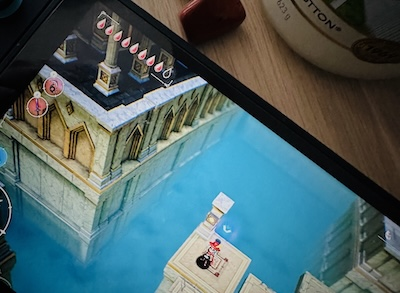

Ci si può sentire così stanchi — così sopraffatti dalla vita — da non riuscire ad accendere la console e giocare un po’ ai videogame?
A me è successo. Anzi, succede spesso. 
Giocare, in quei periodi, diventa l’ennesimo task da completare per sentirsi dire “bravo”. Da chi poi? Vallo a capire… 
 
Ebbene, la _maledizione_ si è spezzata quando ho scaricato [**The Adventures of Elliot: The Millennium Tales**](https://www.youtube.com/watch?v=kt8ixMAlY38), un giochino (nella miglior accezione possibile della definizione) che ricorda moooolto da vicino i vecchi Zelda. L’hanno realizzato gli stessi creatori di Octopath Traveler e Bravely Default.

Elliot è un avventuriero. Va in giro a distruggere cespugli, ammazzare mostri, raccogliere gemme e cuoricini. Con lui una fatina rompipalle (che si può rendere più taciturna nelle impostazioni, ma rompe comunque il cazzo, fidatevi!). Ci sono tutti i cliché del genere: vecchi re, principesse, cavalieri, maledizioni, magie, tesori nascosti, dungeon, enigmi ecc. il tutto condito da viaggi nel tempo e gattini. E su, potevano mancare i gattini?

Niente incontri a turni (brutto dirlo, ma ora mi stressano anche quelli purtroppo), dialoghi veloci, belle musiche, armi varie con potenziamenti flessibili e grafica deliziosa: grafica old style con personaggi in stile anime che compaiono su schermo durante i dialoghi (tutti in italiano, il doppiaggio c’è in inglese e giapponese). 

Un gioco immediato con una grafica che non vuole fingersi realtà. Cazzo sì! Se gioco è perché voglio fuggire dalla realtà, qualsiasi realtà.

La demo dura tipo 2 ore e mezza. Certo, la versione completa l’ho pagata 70€ su Switch 2, ma li vale tutti per quello che mi sta regalando da oltre 10 ore (pare ne duri una trentina in tutto).

_Grazie, Elliot!_ 
